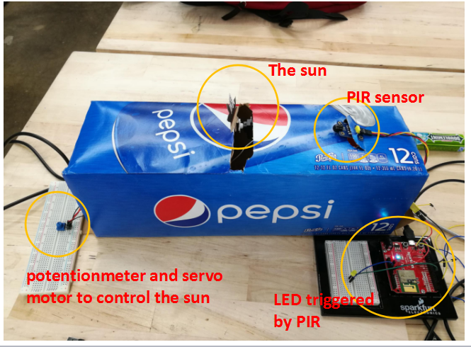
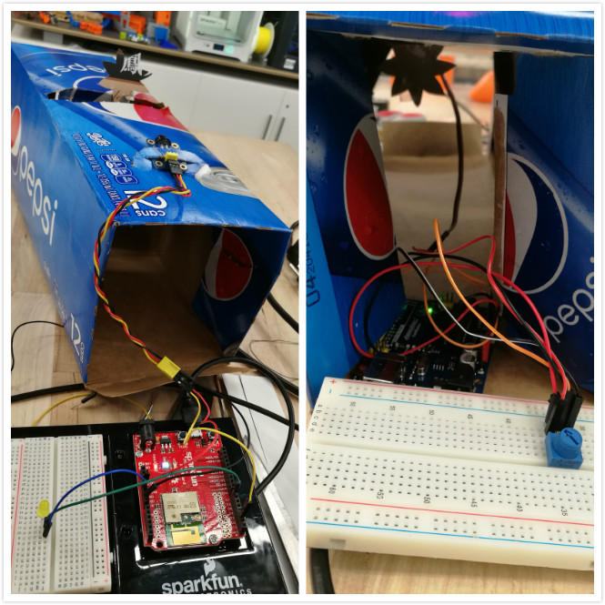

# Midterm IoT Project

Name:  Yuchen Zhao

Date:  10/10/2017

## Project: "Interactive Mini Stage"(individual project name); "Pikachu's Dream"(Group project name)

### Conceptual Description

   My project is an Interactive Mini Stage. This is a kind of mini stage that people could control it, like to change the elements in the stage or change the pattern or color of the led lights. To do this project, I tried to follow the "critical making" idea when I am making this project. To understanding and practice the "critical making" process, for me, it is a kind of "project-oriented" idea instead of "research-oriented"idea. I firstly have a whole idea in my mind and then split it into small ones, then do the small ones one by one and step by step.Like in my project, my main purpose is to make an interactive stage, then I should consider how to use servo motor to let the elemets move and how to let the led lights. Secondly, before starting I will presuppose some questions and try to solve these questions in advance. Then during the process, I realize I will meet more problems that I should solve. So for my understanding,  "solving problems while making and creating" should be the core concept of "critical making". Thirdly, I think "critical making" is a kind of interdisciplinary process which always make me excited. During the process, I should consider to combine the computer science, art and engineering together,this is the most challenging part of "critical making". Lastly, to practice the "critical making", besides to approach the final goal step by step, we will find some unexpected and excieted results druing the whole process also sometimes, we need to create some tools to complete one mission. This is what "critical making" as I understood.
   I am also considering how "critical making" relates to "group work". Do we still need "critical making" while doing group work?　Do we still need "critical making" while doing group work?　How could we balance the individual “critical making” and group “critical making”? During our project, for the better whole group work, we might sometimes give up our own individual idea and obey others. That is hard sometimes, but when doing group discussion we could always find some blinking ideas. For example, in our group work “Pikachu’s dream”, we made a story line to connect each other’s part. This is more interesting than before.

　
### Form

My final project is about a mini interactive stage. The main function in this stage is to use servo motor to control some elements in the stage and use buttons to control the LED's color and pattern. 
So for midterm, I will try to accomplish such two functions first,do a simple prototype to combine with my partern's work and then do some "communicating". 
For the Midterm project, our group's work name is "Pikachu's Dream", which means Pikachu wants you to feed him when the sun rise, you can choose healthy or unhealthy food and then Pikachu will give you responds. (Please see you storytelling sketch)
In my part, I used two boards, one is Arduino Uno+potentionmeter to control the servo motor, the other is Sparkfun to control the PIR sensor. At the beginning, the PIR will detect the sun rise and send  some information to the Email through IFTTT, then we could know “it’s Pika’s time to eat”, (then for Jo’s part), there are two buttons on the Pikachu’s body, one is represent healthy food, the other is unhealthy. When you press “healthy” button, the LED (on me) will turn on, if unhealthy food chosen, the light will turn off.

**Finished Enclosure:**



**Electronics Exposed:**



### Technical Details
//   
Here you should give an overview of the technical operation of your device, including:
* A wiring diagram
* list of hardware used
  List of hardware I used:
  1/ One Sparkfun Redboard
  2/ One Arduino Uno
  3/ PIR sensor
  4/ LED
  5/ servo motor
  6/ potentionmeter
  
* Explanation of your
For the peoject's explanation, please see the "FORM".
For the "communicating" part, we did bothways. First, when PIR sensor detect the sun rise, it will “particle.publish()”and Jo will subscribe this then to send herself an Email(tell people Pikachu need to feed). Then people will press button on Pikachu and choose the food, then different button will trigger different things (LED turn on/ off) and then particle.publish(). Then my LED will particle.subscribe() these two buttons function and then turn on/off accordingly.
* Link to code   

//

You can include code snippets here:

```

  pinMode(PIRPPin, INPUT);
  pinMode(LEDPin, OUTPUT);
  
  pinMode(LEDPin2,OUTPUT);
  digitalWrite(LEDPin2,LOW);
  
  Particle.subscribe("pika", lightup,"57003a001251353338363333");
  Particle.subscribe("pika2",lightdown,"57003a001251353338363333");
  
 
  Serial.begin(9600);
```

but also link to your project's full code in this repository:  [photon.ino](photon.ino)

**Wiring Diagram**


