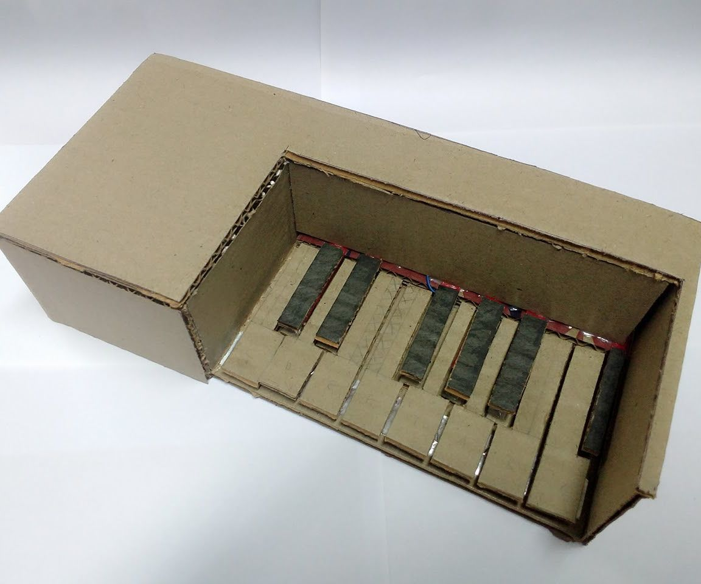
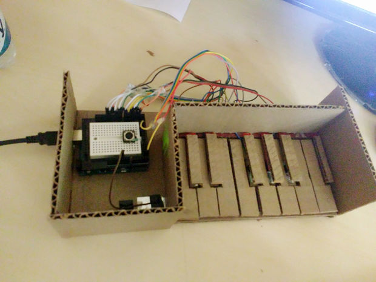
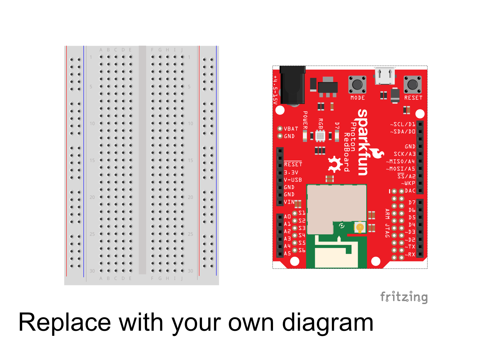

# Midterm IoT Project

Name:  Yuchen Zhao

Date:  10/10/2017

## Project: "Interactive Mini Stage"(individual project name); "Pikachu's Dream"(Group project name)

### Conceptual Description

   My project is an Interactive Mini Stage. This is a kind of mini stage that people could control it, like to change the elements in the stage or change the pattern or color of the led lights. To do this project, I tried to follow the "critical making" idea when I am making this project. To understanding and practice the "critical making" process, for me, it is a kind of "project-oriented" idea instead of "research-oriented"idea. I firstly have a whole idea in my mind and then split it into small ones, then do the small ones one by one and step by step.Like in my project, my main purpose is to make an interactive stage, then I should consider how to use servo motor to let the elemets move and how to let the led lights. Secondly, before starting I will presuppose some questions and try to solve these questions in advance. Then during the process, I realize I will meet more problems that I should solve. So for my understanding,  "solving problems while making and creating" should be the core concept of "critical making". Thirdly, I think "critical making" is a kind of interdisciplinary process which always make me excited. During the process, I should consider to combine the computer science, art and engineering together,this is the most challenging part of "critical making". Lastly, to practice the "critical making", besides to approach the final goal step by step, we will find some unexpected and excieted results druing the whole process also sometimes, we need to create some tools to complete one mission. This is what "critical making" as I understood.
   I am also considering how "critical making" relates to "group work". Do we still need "critical making" while doing group work?　Do we still need "critical making" while doing group work?　How could we balance the individual “critical making” and group “critical making”? During our project, for the better whole group work, we might sometimes give up our own individual idea and obey others. That is hard sometimes, but when doing group discussion we could always find some blinking ideas. For example, in our group work “Pikachu’s dream”, we made a story line to connect each other’s part. This is more interesting than before.

　
### Form

/// Your project should be embodied in a ***physical form*** that reflects, embodies, and/or amplifies those your project's main concepts and ideas.
Explain your design choices here and include images that document your project's material embodiment. ///

**Finished Enclosure:**



**Electronics Exposed:**



### Technical Details
//   
Here you should give an overview of the technical operation of your device, including:
* A wiring diagram
* list of hardware used
* Explanation of your
* Link to code   

//

You can include code snippets here:

```
Particle.subscribe("Execute", messageParse, MY_DEVICES);
```

but also link to your project's full code in this repository:  [photon.ino](photon.ino)

**Wiring Diagram**


